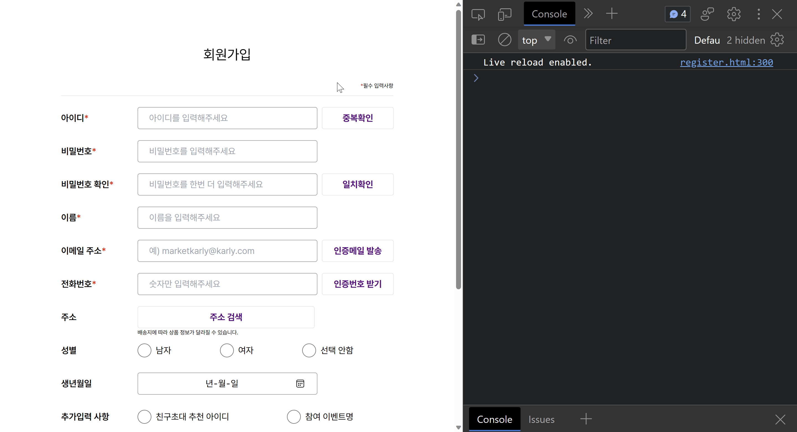
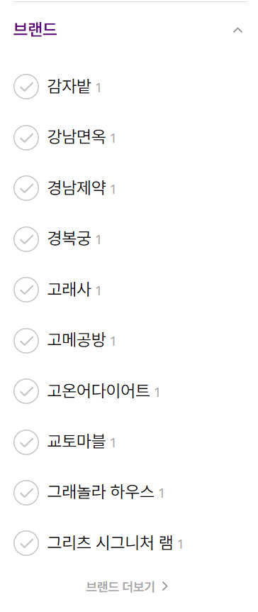

# 까짓거 함 햅5조 - vanilla JS - marketKarly

- 배포 URL : https://github.com/FE-6-vanilla-JS-5/vanillaJS__marketKarly/tree/develop
- Test ID : id_sample
- Test PW : pw_sample

 

---

## ⚙️기술 스택
 

---

## 1. 팀원 구성

|                                                     **백상호**                                                     |                                                    **조희정**                                                    |                                                     **양정아**                                                      |                                                  **이재호**                                                   |
| :----------------------------------------------------------------------------------------------------------------: | :--------------------------------------------------------------------------------------------------------------: | :-----------------------------------------------------------------------------------------------------------------: | :-----------------------------------------------------------------------------------------------------------: |
| [   @bigCoDult](https://github.com/bigCoDult) | [   @tuna7797](https://github.com/tuna7797) | [   @jjang-aaa](https://github.com/jjang-aaa) | [   @ewsn0825](https://github.com/ewsn0825) |

 

---

## 2. 역할 분담

### 조희정

- **UI**
  - 페이지 : 마켓칼리 베스트 상품목록
- **기능**
  - 데이터를 이용한 상품목록 ui 렌더링
  - Left navigation Drop/Down JS 애니메이션 구현
  - localstorage를 이용한 최근 본 상품 floating menu 구현
  - scrollTop floating menu 세로 슬라이드 JS 애니메이션 구현
  - ajax 비동기 통신을 통한 페이징 넘버링 구현

 
    
### 이재호

- **UI**
  - 페이지 : 메인, 헤더, 푸터
- **기능**
  - mainBanner
    자동으로 2.5초 후 다음 슬라이드로 넘어가는 기능
    현재 슬라이드 인덱스 출력하는 기능
    버튼과 키보드 화살표를 이용해서 이전, 다음 슬라이드로 넘기는 기능
    mainBanner 위에 마우스 호버 시 버튼 천천히 보이고 사라지는 애니메이션 기능
  - productsList
    버튼을 클릭하여 이전, 다음 슬라이드로 넘기는 기능
    이미지에 호버 시 이미지 확대하는 애니메이션 기능
    slide 4개 그룹으로 넘기는 기능
  - 팝업창
    닫기 버튼 누르면 사라지는 기능

 

### 양정아

- **UI**
  - 상품 상세 페이지
  - 장바구니 페이지
- **기능**
  - 페이지 url에 data의 id 값을 가져와서 id에 해당하는 상품의 정보가 상품 상세 페이지에 렌더링되는 기능 구현
  - 상품수량의 +, - 버튼을 누르면 상품수량이 카운트되는 기능 구현
  - 상품 수량에 맞게 총 상품금액이 계산되어 나오는 기능 구현
  - 장바구니 담기를 누르면 상품정보(상품명, 상품수량, 상품금액)가 로컬스토리지에 담기는 기능 구현
  - 로컬스토리지에 담긴 상품정보들이 장바구니 목록에 나오는 기능 구현
  - 장바구니 목록에 여러 상품들이 담기면 총 상품금액과 배송비를 합친 결제금액이 나오는 기능 구현
  - 장바구니 목록에서 여러 상품들을 한번에 제거할 수 있는 기능 구현
     

### 백상호

- **UI**
  - 페이지 : 로그인, 회원가입
- **기능**
  - 스크럼 마스터
  - 회원가입 id 중복여부 확인
  - 회원가입 pw의 정규식 부합 확인
  - 회원가입 pw의 일치확인
  - 로그인 성공시 uniqueId를 localStorage에 저장

---

## 3. 개발 기간

- 전체 개발 기간 : 2023-07-28 ~ 2022-08-02
- UI 구현 : 2023-07-28 ~ 2023-07-30
- 기능 구현 : 2023-07-30 ~ 2023-08-02

---

## 4. 페이지별 기능

### 로그인

 
 

 

### 회원가입

 

### 프로덕트 리스트

 

### 상품 상세 페이지

 

### 장바구니 페이지

 

### 메인 페이지

