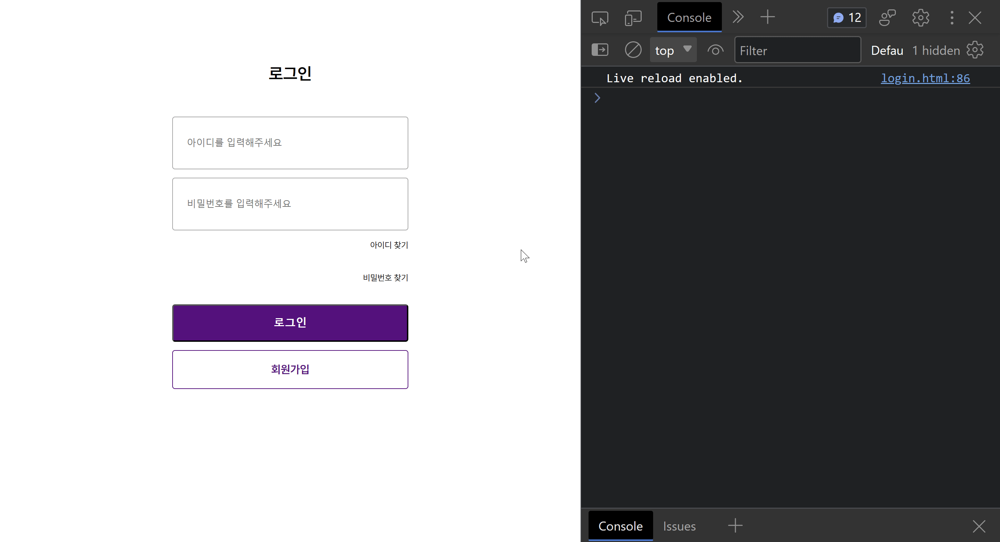

# 까짓거 함 햅5조 - vanilla JS - marketKarly

- 배포 URL : https://github.com/FE-6-vanilla-JS-5/vanillaJS__marketKarly/tree/develop
- Test ID : id_sample
- Test PW : pw_sample

 

## 1. 팀원 구성

| **조희정** | **이재호** | **양정아** | **백상호** |
| :------: |  :------: | :------: | :------: |
|

 

## 2. 역할 분담

### 조희정

- **UI**
    - 페이지 : 쩌는 UI
- **기능**
    - 쩌는 기능

 
    
### 이재호

- **UI**
    - 페이지 : 쩌는 UI
- **기능**
    - 쩌는 기능

 

### 양정아

- **UI**
  - 상품 상세 페이지
  - 장바구니 페이지
- **기능**
  - 페이지 url에 data의 id 값을 가져와서 id에 해당하는 상품의 정보가 상품 상세 페이지에 렌더링되는 기능 구현
  - 상품수량의 +, - 버튼을 누르면 상품수량이 카운트되는 기능 구현
  - 상품 수량에 맞게 총 상품금액이 계산되어 나오는 기능 구현
  - 장바구니 담기를 누르면 상품정보(상품명, 상품수량, 상품금액)가 로컬스토리지에 담기는 기능 구현
  - 로컬스토리지에 담긴 상품정보들이 장바구니 목록에 나오는 기능 구현
  - 장바구니 목록에 여러 상품들이 담기면 총 상품금액과 배송비를 합친 결제금액이 나오는 기능 구현
  - 장바구니 목록에서 여러 상품들을 한번에 제거할 수 있는 기능 구현
 
    
### 백상호

- **UI**
    - 페이지 : 로그인, 회원가입
- **기능**
    - 스크럼 마스터
    - 회원가입 id 중복여부 확인 
    - 회원가입 pw의 정규식 부합 확인
    - 회원가입 pw의 일치확인
    - 로그인 성공시 uniqueId를 localStorage에 저장

 

## 3. 페이지별 기능

### 로그인

### 회원가입

 
