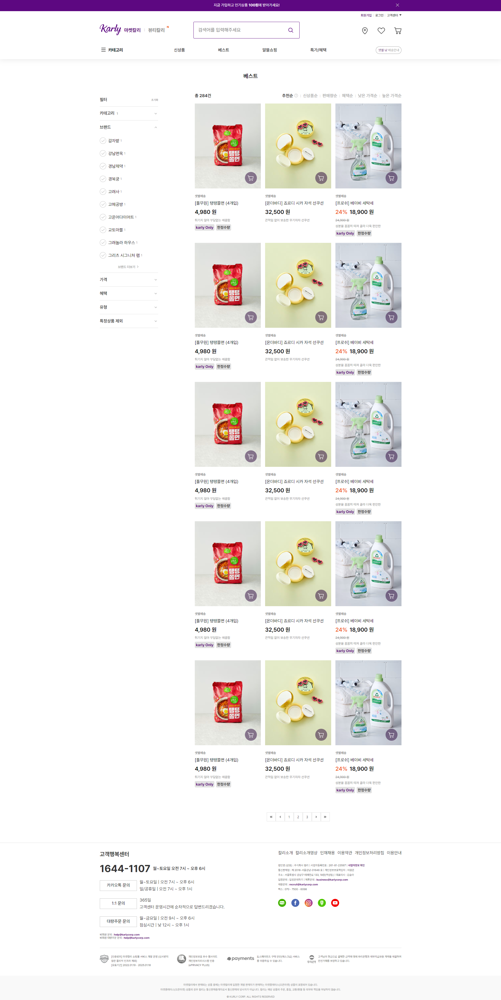
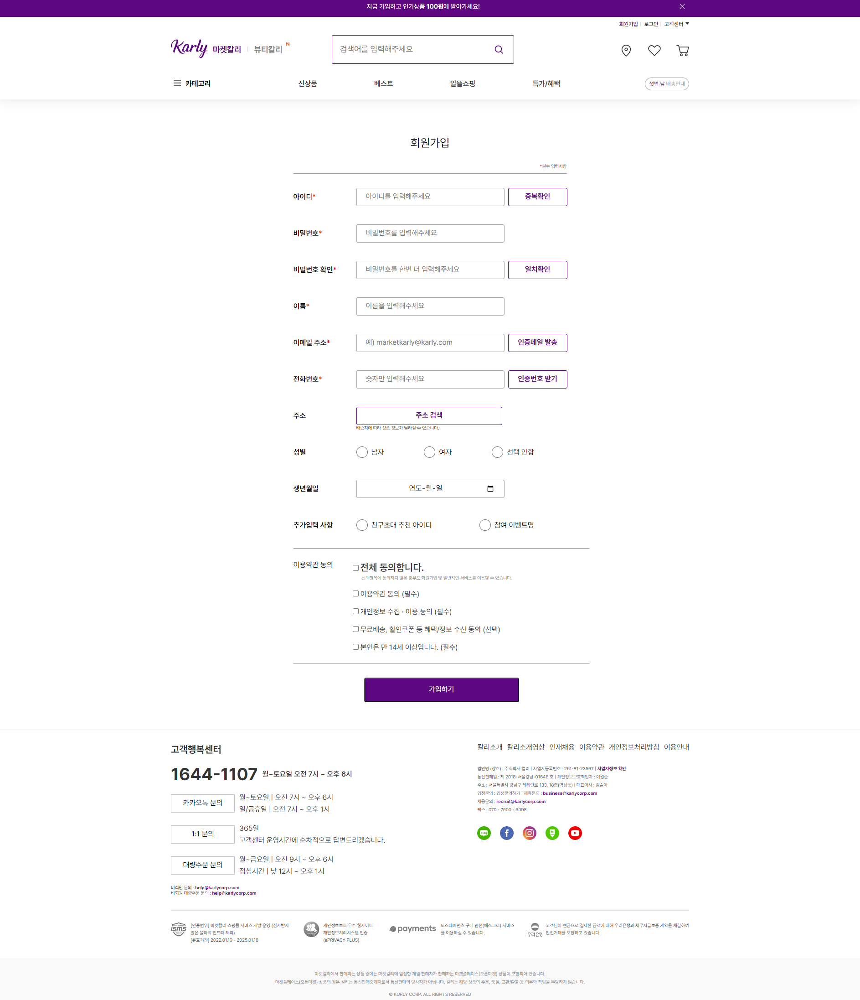
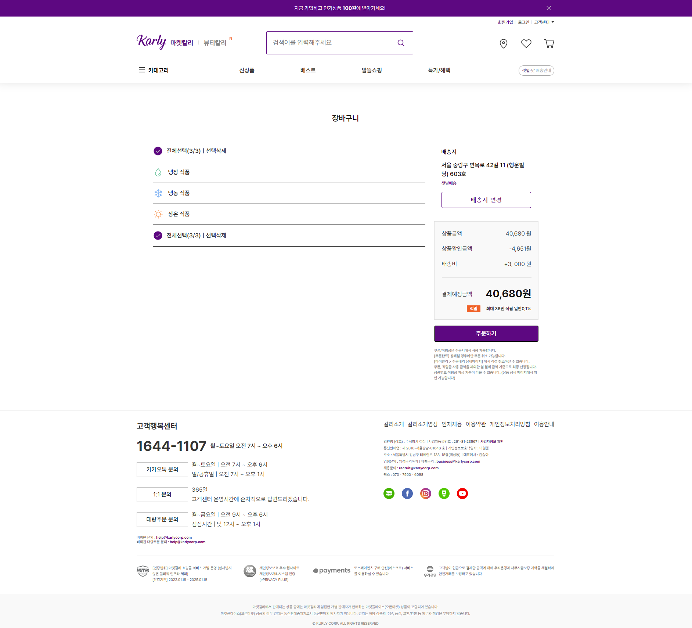

<div align=start>

 # <strong>마켓컬리 Kurly</strong>
 
 
 
  <div align=center>
 
 ### 🍀<strong>Introduction</strong>
 안녕하세요. 마켓컬리를 진행한 팀<br />
 겁나 10조?입니다.  
<br/>   
  


 ### <strong>⭐Team members</strong>

이재호(조장)
김남진(팀원)
백상호(팀원, 스크럼마스터)
장효윤(팀원)  
<br/> 

 ### <strong>🔥SKILL</strong>

 HTML, CSS, SCSS 
  
<br/>

<div align=start>  
  
### <strong>📃Completed Pages✏️</strong>  
    

+ <strong>Main</strong> - 장효윤
+ <strong>Register</strong> - 백상호
+ <strong>login</strong> - 김남진
+ <strong>Product-List</strong> - 이재호
+ <strong>Product-Detail</strong>- 장효윤
+ <strong>Cart</strong> - 김남진  
  <br/>

### <strong>🌊웹접근성 aria 사용법</strong>  
    

+ aria-lebal : button, 읽기어려운 글들을 aria-lebal로 값을 주었습니다.
+ aria-hidden="true" : 읽지 않아도되는 정보를 스크린리더가 읽지 않게 hidden 처리 헀습니다.
+ class="a11yHidden" : 화면에는 보이지않은 중요한 정보들을 보여주기 위해 사용했습니다.

+ 스크린 리더 검사: 윈도우 내레이터 사용하여 웹접근성을 확인했습니다.
### <strong>🎨성능 검사</strong>  
    
크롬 개발자 도구 성능 검사


### <strong>🗝️프로젝트 한줄평</strong>  
    

+ 이재호: 좋은 팀원분들과 같이 프로젝트를 하며 높은 수준의 결과물을 만들 수 있어서 좋았습니다.
+ 김남진: SASS와 GitHub를 통한 협업은 지금까지 배운 것들의 결정체.
+ 백상호: 약점(css)은 보완하고 강점(cli)은 강화하는 시간
+ 장효윤: 배운 html과 css로 사이트를 충분히 구성할 수 있다는것에 놀랍고 뿌듯했습니다. 그리고 sass를 협업하며 사용함으로서 sass의 편리함을 느끼게 되었습니다. 마지막으로 팀프로젝트 협업을 하면서 정말 많이 배웠습니다.


<br><br><br><br><br>

<!-- 메인페이지 -->
# <strong>✏️Main-page</strong>

진행자: 장효윤
### **🖥️Image**
 


### **📌HTML 마크업 순서**(Main-page)
- &lt;main&gt;
  - &lt;section&gt; 메인 배너 섹션
  - &lt;section&gt; 오늘 추천상품 '이 상품 어때요?' 섹션
  - &lt;section&gt; 중간 서브 라인 배너 섹션
  - &lt;aside&gt; 최근 본 상품 오른쪽 사이드바
  - &lt;aside&gt; 뷰티컬리 광고 팝업창

<br>

<details>
<summary>📝HTML 핵심 코드</summary>
<div markdown="1">

```html 
    <!-- 메인 배너 섹션-->
      <section class="mainBanner">
        <h2 class="a11yHidden">메인 배너</h2>
        <figure class="mainBanner__imageBox">
          
          <figcaption class="a11yHidden">
            컬리 장보기의 특권&#44; 이 주의 특가 한 눈에 보기&#44; 우측 상단
            특가 혜택에서 확인하세요
          </figcaption>
        </figure>
        <div class="mainBanner__page" aria-label="메인 배너 다섯 개중 첫번째">
          1&#47;5
        </div>
        <!-- 오늘 추천상품 '이 상품 어때요?' 섹션 -->
				<!-- 오늘 추천상품 '놓치면 후회할 가격' 섹션 -->
      </section>
      <section class="recommendProduct">
        <h2 class="recommendProduct__title" aria-label="오늘 추천 상품">
          이 상품 어때요?
        </h2>
				<!-- 상품 리스트 부분 -->
        <ul class="recommendProduct__list">
          <li class="recommendProduct__product" aria-label="상품 일번">
            <a href="/">
              <figure class="recommendProduct__image">
                
              </figure>
            </a>
            <a
              class="recommendProduct__name"
              href="/"
              aria-label="풀무원 탱탱쫄면 네개입"
              >&#91;풀무원&#93; 탱탱쫄면 &#40;4개입&#41;</a
            >
            <span
              class="recommendProduct__price"
              aria-label="가격 사만구천팔십 원"
              >4&#44;980 원</span
            >
            <button
              class="recommendProduct__cart"
              aria-label="장바구니 버튼"
            ></button>
          </li>
        </ul>
        <button
          class="recommendProduct__rightArrow"
          aria-label="추천상품 더보기 버튼"
        ></button>
      </section>
      <!-- 중간 서브 라인 배너 섹션-->
      <section class="lineBanner">
        <h2 class="a11yHidden">서브 라인 배너</h2>
        <figure class="lineBanner__imageBox">
          
          <figcaption class="a11yHidden">
            더 풍성해진 10월 퍼플위크 이벤트 진행&#44; 적립률 올라가고 3종
            쿠폰팩 증정
          </figcaption>
        </figure>
      </section>
      <!-- 최근 본 상품 오른쪽 사이드바 -->
      <aside>
        <section class="recentProduct">
          <h2>최근 본 상품</h2>
			<!-- 최근 본 상품 리스트 -->
          <ul class="recentProduct__list">
            <li class="recentProduct__item">
              <a href="/">
                
              </a>
            </li>
          </ul>
      <!-- 최근 본 상품 버튼 -->
          <button
            class="recentProduct__buttonUp recentProduct__sprite"
            aria-label="최근 본 상품 위로가기 버튼"
          ></button>
        </section>
```
</div>
</details>
<br>

---

### **📌SASS 진행코드**(Main-page)
<br>
<details>
<summary>📝SASS 상세코드보기</summary>
<div markdown="1">

```scss
.main__main {
  margin: 0;
  width: 100%;
  font-family: Pretendard;
  position: relative;
  
  // 메인 배너 
  & .mainBanner {
    position: relative;
    padding: 0;
  }
}
.mainBanner{
  //메인 배너 이미지
  &__image {
    width: 100%;
  }
}

// 오늘 추천 상품 섹션 
.recommendProduct {
  position: relative;
  width: rem(1050px);
  // height: 650px; 
  @include autoMargin;
  padding: rem(70px) 0;
  box-sizing: border-box;
  // 상품 리스트 부분 
  &__list {
    list-style: none;
    padding-left: 0;
    @include flexbox($justify: space-between);
  }
  // 상품사진 하단오른쪽에 있는 장바구니 버튼 
  &__cart {
    cursor: pointer;
    @include pos;
    bottom: 30%;
    right: 8%;
    background: #2a0038 url("/images/Icon/Cart.png");
    background-position: center;
    opacity: 50%;
    width: rem(42px);
    height: rem(42px);
    border-radius: 50%;
    border: 0;
  }
}
// 서브 라인배너 
.lineBanner {
  width: rem(1050px);
  margin: rem(40px) auto;
  padding: 0;
}

// 최근 본 상품 
.recentProduct {
  position: relative;
  position: fixed;
  top: 50%;
  right: 2%;
  width: rem(74px);
  height: rem(223px);
  font-size: rem(7px);
  text-align: center;
  padding: rem(35px) 0;
  border: 1px solid $gray-200;
  box-sizing: border-box;
  background: $white;
  // 최근 본 상품 이미지 공통 넓이 
  & img {
    width: 100%;
  }
  // 최근 본 상품 버튼
  &__sprite {
    cursor: pointer;
    width: rem(18px);
    height: rem(18px);
    background: url("/images/Icon/Arrow-2.png");
    position: absolute;
    border: none;
  }
  // 최근 본 상품 위로가기 버튼
  &__buttonUp {
    background-position: 50% 10%;
  
    top: 4%;
    right: 37%;
  }
}
// 메인 뷰티컬리 광고 팝업창 
.mainPopup {
  width: rem(345px);
  height: rem(530px);
  border-radius: rem(16px);
  background: $white;
  box-shadow: 0 rem(8px) rem(36px) 0 $gray-200;
  color: $content;
  font-weight: 700;
  position: fixed;
  bottom: rem(10px);
  left: rem(7px);
}
```
</div>
</details>  


<br/><br><br>

<!-- 프로덕트 디테일 페이지 -->
# <strong>🛍️Product Detail-page</strong>


진행자: 장효윤
### **🖥️Image**
 


### **📌HTML 순서**(Product Detail-page)
- &lt;main&gt;
  - &lt;section&gt; 상품 상세설명 섹션
    - &lt;div&gt; 상품 제목박스
    - &lt;figure&gt; 상품 이미지
    - &lt;dl&gt; 상품 설명 리스트
    - &lt;div&gt; 상품 결제박스
  
 
  
    - &lt;section&gt; 상품 상세페이지 섹션
    - &lt;div&gt; 상품 전체 상세페이지 박스
    - &lt;div&gt; 설명,정보,후기,문의 페이지 이동 박스

<br>

<details>
<summary>📝HTML 핵심 코드</summary>
<div markdown="1">

```html 
   <!-- 상품 상세설명 섹션-->
      <section class="productDetail">
        <div class="productDetail__titleBox">
          <h2 class="productDetail__title" aria-label="풀무원 탱탱쫄면 네개입">
        </div>
        <figure class="productDetail__image">
          
        </figure>
<!-- 상품 상세설명 리스트-->
        <dl class="productDetail__list">
          <div class="productDetail__item">
            <dt>배송</dt>
            <dd>
              <span class="productDetail__fontBold">샛별배송</span><br />
              23시 전 주문시 내일 아침 7시 전 도착<br />
              &#40;대구 부산 울산 샛별배송 운영시&#59;간 별도 확인&#41;
            </dd>
	         </div>
        </dl>
<!-- 상품 상세설명 상품 장바구니 담기 버튼 박스-->
        <div class="productDetail__productcart">
          <dl class="productDetail__allPrice">
            <dt>총 상품금액&#58;</dt>
            <dd aria-label="사천구백팔십원">
              <span class="productDetail__fontSizeXl">4&#44;980</span> 원
            </dd>
          </dl>
          <div class="productDetail__allButton">
            <button
              class="productDetail__cartButton"
              aria-label="장바구니 담기 버튼"
            >
              장바구니 담기
            </button>
          </div>
        </div>
      </section>
      <!-- 상세페이지 섹션-->
      <section class="description">
        <div class="description__content">
          <h3 class="a11yHidden">상품설명</h3>
          <figure class="description__image">
            
          </figure>
          <div class="description__titleBox">
            <span class="description__subTitle"
              >튀기지 않아 부담없는 매콤함</span
            >
            <span class="description__title">&#91;풀무원&#93; 탱탱쫄면</span>
          </div>
          <figure class="description__descriptionImage">
            
            <figcaption class="a11yHidden">
              생산 유통 과정은 튀기지 않고 바람으로 말린면이다&#46; 활용법은
              온가족이 즐기기 좋은 4개입 포장과 간편한 조리로 완성하는
              쫄면이다&#46; 브랜드와 생산자는 풀무원이다&#46;
            </figcaption>
          </figure>
          <h3 class="a11yHidden">상세정보</h3>
          <figure class="description__descriptionImage2">
            
            <figcaption class="a11yHidden">
              풀무원 탱탱 쫄면은 123그램 4개입이다&#46; 쫄면의 영양정보 이미지
            </figcaption>
          <div class="productReview">
        </div>
  <!-- 상품설명, 후기, 문의 페이지 이동 버튼-->
        <div class="description__buttonBox">
          <button
            class="description__button description__buttonPurple"
            type="button"
            aria-label="상품설명 이동 버튼"
          >
            상품설명
          </button>
        </div>
      </section>
```
</div>
</details>
<br>

---

### **📌SASS 진행코드**(Main-page)
<br>
<details>
<summary>📝SASS 상세코드보기</summary>
<div markdown="1">

```scss
//제품 설명 박스
.productDetail{
  position: relative;
  width: rem(1050px);
  font-family: Pretendard;
  font-size: rem(16px); 
  @include autoMargin;
  padding: rem(60px) 0;
  box-sizing: border-box;
  //설명 박스를 margin left줘서 이미지가 위치할 수있도록 한다.
  &__productcart, &__list, &__titleBox, &__productcart {
    margin-left: 480px;
  }
  //상품상세 설명표 리스트
  &__item{
    display: flex;
    @include paddingY(16px);
    border-top: 1px solid $gray-100; 
    font-size: rem(12px);
  }
  &__item:last-child{
    border-bottom: 1px solid $gray-100;
  }
  //상품 선택 할 수 있는 박스
  &__select {
    position: relative;
    width: rem(432px);
    height: rem(83px);
    border: rem(1px) solid $gray-100;
    color: $gray-600;
    font-weight: 600;
    @include padding(12px);
  }
  //상품 수량 선택 박스
  &__selectBox {
    height: rem(30px);
    width: rem(83px);
    border: rem(1px) solid $gray-200;
    margin-top: rem(12px);
    text-align: center;
  }
 //총 상품금액
  &__allPrice {
    @include flexbox($justify: flex-end, $items: center);
    column-gap: rem(17px);
    font-size: 16px;
    font-weight: 600;
    line-height: 150%;
    margin-top: rem(28px);
  }
  // 알림, 좋아요, 장바구니 버튼
  &__allButton {
    @include flexbox($justify: space-between)
  }
  &__button {
    cursor: pointer;
    width: 56px;
    height: 56px;
    padding: 4px;
    border: 1px solid $gray-100;
    // background: $white;
  }
  &__heart{
    background: url('/images/Icon/Squre.png');
    background-position: 50% 89% ;
  }
}
//상세페이지 섹션
.productDetail__list .productDetail__item{
  display: flex;
}
// 이미지 상세페이지 부분
.description{
  position: relative;
  width: rem(1050px);
  font-family: Pretendard;
  font-size: rem(16px);
  @include flexbox($direction: column-reverse);
  @include autoMargin;
  //상세페이지 첫번째 이미지
  &__image img{
    width: 100%;
    margin-top: rem(40px);
  }
  //상세페이지 제목 박스
  &__titleBox {
    color: $black;
    @include flexbox($direction: column);
    @include padding(76px);
    text-align: center;
    border-bottom: 1px solid $gray-100;
  }
  //상세페이지 서브 제목
  &__subTitle {
    
    font-size: rem(28.43px);
    font-weight: 600;
    line-height: 150%;
  }
  //상세페이지 제목
  &__title {
    font-size: rem(50.517px);
    font-weight: 700;
    line-height: 140%;
  }
  //상세페이지 제품 설명글
  &__p {
    margin-top: rem(40px);
    padding-bottom: rem(200px);
    border-bottom: 1px solid $gray-100;
  }
  //상세페이지 컬리가 제품설명하는 이미지
  &__descriptionImage{
    margin-bottom: rem(96px);
  }
  //제품설명, 상세정보, 후기, 문의 버튼바 
  &__button{
    cursor: pointer;
    height: rem(54px);
    width: 25%;
    float: left;
    border-radius: 0;
    border: 1px solid $gray-200;
    background: #F9F9F9;
    font-size: 16px;
    font-weight: 600;
    line-height: 150%;
  }
  &__button span{
    padding-left: rem(5px);
    font-size: rem(12.003px);
    line-height: 160%;
  }
  &__buttonPurple{
    background: $white;
    color: $primary;
    border: 1px solid#e0e0e0;
  }
}
//Why karly 부분
.whyKarly{
  @include marginY(84px);
  @include paddingX(12px);
  &__item{
    text-align: center;
    box-sizing: border-box;
    width: rem(315px);
    padding-top: rem(56px);
  }
  &__check {
    background: url('/images/Icon/check-list-purple.svg');
  }
  &__subTitle{
    color: $primary;
    font-size: rem(21.328px);
    font-weight: 600;
    line-height: 150%;  
  }
  &__sub p{
    padding-top: rem(24px);
    @include autoMargin;
    line-height: 160%;
    width: 77%;
  }
}
  // 후기 작성하기 버튼
  &__button{
    cursor: pointer;
    @include posRightTop($r:0, $t:0);
    color: $white;
    border-radius: 4px;
    background: $primary;
    width: 155px;
    height: 44px;
    border: 0;
  }
}
```
</div>
</details>  


<br/><br><br>

<!-- 프로덕트 리스트 페이지 -->
# <strong>📄productList-page</strong>

진행자: 이재호
### **🖥️Image**
 


### **📌HTML 순서** (productList-page)
- &lt;main&gt;
  - &lt;h3&gt; 프로덕트 리스트 제목 : 베스트
  - &lt;div&gt; 사이드바 컨테이너
  - &lt;div&gt; 프로덕트 컨테이너
  - &lt;ul&gt; 프로덕트 메뉴
  - &lt;ul&gt; 프로덕트 리스트
  - &lt;ul&gt; 페이지 이동 버튼 리스트

<br>

<details>
<summary>📝HTML 핵심 코드</summary>
<div markdown="1">

```html 
   <!-- 프로덕트 리스트 제목 : 베스트 -->
   <h3 class="productList__title">베스트</h3>

   <!-- 사이드바 컨테이너 -->
   <div class="sideBar" role="group" aria-label="사이드바 메뉴">

    <div class="sideBar__button" aria-label="사이드바 필터">
      <span>필터</span>
      <a href="" class="reset__button">초기화</a>
    </div>

    <button class="sideBar__button" type="button">
      <span>카테고리<span class="grayNum__small" aria-hidden="true">1</span></span>
      <span class="arrowBottom"></span>
    </button>

    <button class="sideBar__button__clicked" type="button">
      <span>브랜드</span>
      <span class="arrowTop"></span>
    </button>
    <ul class="brand" aria-label="브랜드별 상품 보기">
      <li class="brand__list"><a href="" class="brand__link">감자밭<span class="grayNum"
            aria-hidden="true">1</span></a></li>
      <li class="brand__list"><a href="" class="brand__link">강남면옥<span class="grayNum"
            aria-hidden="true">1</span></a></li>
      <li class="brand__list"><a href="" class="brand__link">경남제약<span class="grayNum"
            aria-hidden="true">1</span></a></li>
      <li class="brand__list"><a href="" class="brand__link">경복궁<span class="grayNum"
            aria-hidden="true">1</span></a></li>
      <li class="brand__list"><a href="" class="brand__link">고래사<span class="grayNum"
            aria-hidden="true">1</span></a></li>
      <li class="brand__list"><a href="" class="brand__link">고메공방<span class="grayNum"
            aria-hidden="true">1</span></a></li>
      <li class="brand__list"><a href="" class="brand__link">고온어다이어트<span class="grayNum"
            aria-hidden="true">1</span></a></li>
      <li class="brand__list"><a href="" class="brand__link">교토마블<span class="grayNum"
            aria-hidden="true">1</span></a></li>
      <li class="brand__list"><a href="" class="brand__link">그래놀라 하우스<span class="grayNum"
            aria-hidden="true">1</span></a></li>
      <li class="brand__list"><a href="" class="brand__link">그리츠 시그니처 램<span class="grayNum"
            aria-hidden="true">1</span></a></li>
      <li class="btn__list"><button type="button" class="more__button">브랜드 더보기</button></li>
    </ul>

    <button class="sideBar__button" type="button">
      <span>가격</span>
      <span class="arrowBottom"></span>
    </button>

    <button class="sideBar__button" type="button">
      <span>혜택</span>
      <span class="arrowBottom"></span>
    </button>

    <button class="sideBar__button" type="button">
      <span>유형</span>
      <span class="arrowBottom"></span>
    </button>

    <button class="sideBar__button" type="button">
      <span>특정상품 제외</span>
      <span class="arrowBottom"></span>
    </button>

  </div>

   <!-- 프로덕트 리스트 -->
    <ul class="product__wrap">
      <li class="product__list"><a href="/views/productDetail.html" class="product__link">
          <span class="product__info">
            <span class="tag" aria-label="상품태그 샛별배송">샛별배송</span>
            <span aria-label="상품이름 풀무원 탱탱쫄면 사 개입">[풀무원] 탱탱쫄면 (4개입)</span>
            <span class="product__price" aria-label="상품 가격 4980 원">4,980 원</span>
            <span class="product__summary" aria-label="상품 설명 튀기지 않아 부담없는 매콤함">튀기지 않아 부담없는 매콤함</span>
            <span class="product__badge" aria-label="상품 뱃지">
              <span class="karlyBadge" aria-label="칼리 온리 뱃지">karly Only</span>
              <span class="textBadge" aria-label="한정수량 뱃지">한정수량</span>
            </span>
          </span>

          <figure class="imgContainer">
            <figcaption class="a11y" aria-hidden="true">풀무원 탱탱쫄면</figcaption>
            
          </figure>
          <span class="cartIcon"></span>
        </a></li>
      <li class="product__list"><a href="/" class="product__link">
          <span class="product__info">
            <span class="tag" aria-label="상품태그 샛별배송">샛별배송</span>
            <span aria-label="상품 이름 온더바디 죠르디 시카 자석 선쿠션">[온더바디] 죠르디 시카 자석 선쿠션</span>
            <span class="product__price" aria-label="상품 가격 32500 원">32,500 원</span>
            <span class="product__summary" aria-label="상품 설명 끈적임 없이 보송한 무기자차 선쿠션">끈적임 없이 보송한 무기자차 선쿠션</span>
          </span>

          <figure class="imgContainer">
            <figcaption class="a11y" aria-hidden="true">죠르디 시카 자석 선쿠션</figcaption>
            
          </figure>
          <span class="cartIcon"></span>
        </a></li>
      <li class="product__list"><a href="/" class="product__link">
          <span class="product__info">
            <span class="tag" aria-label="상품태그 샛별배송">샛별배송</span>
            <span aria-label="상품 이름 프로쉬 베이비 세탁세">[프로쉬] 베이비 세탁세</span>
            <span class="discount">
              <span class="discountRate" aria-label="할인율 24%">24%</span>
              <span class="discountPrice" aria-label="할인된 가격 18900원">18,900 원</span>
            </span>
            <span class="nonDiscount" aria-label="할인전 가격 24900원">24,900 원</span>
            <span class="product__summary" aria-label="상품 설명 성분을 꼼꼼히 따져 골라 더욱 편안한">성분을 꼼꼼히 따져 골라 더욱 편안한</span>
            <span class="product__badge" aria-label="상품 뱃지">
              <span class="karlyBadge" aria-label="칼리 온리 뱃지">karly Only</span>
              <span class="textBadge" aria-label="한정수량 뱃지">한정수량</span>
            </span>
          </span>

          <figure class="imgContainer">
            <figcaption class="a11y" aria-hidden="true">베이비 세탁세</figcaption>
            
          </figure>
          <span class="cartIcon"></span>
        </a></li>
    </ul>
   <!-- 페이지 이동 버튼 리스트 -->
   <div class="movePage">
    <ul class="movePage__wrap">
      <li class="movePage__list"><a href="/" class="movePage__link">
          <span class="doubleLeft"></span>
          <span class="a11y">처음 페이지로 가기 버튼</span>
        </a></li>
      <li class="movePage__list"><a href="/" class="movePage__link">
          <span class="left"></span>
          <span class="a11y">이전 페이지로 가기 버튼</span>
        </a></li>
      <li class="movePage__list"><a href="/" class="movePage__link">
          <span class="pageNum">1</span>
          <span class="a11y">페이지</span>
        </a></li>
      <li class="movePage__list"><a href="/" class="movePage__link">
          <span class="pageNum">2</span>
          <span class="a11y">페이지</span>
        </a></li>

      <li class="movePage__list"><a href="/" class="movePage__link">
          <span class="pageNum">3</span>
          <span class="a11y">페이지</span>
        </a></li>
      <li class="movePage__list"><a href="/" class="movePage__link">
          <span class="right"></span>
          <span class="a11y">다음 페이지로 가기 버튼</span>
        </a></li>
      <li class="movePage__list"><a href="/" class="movePage__link">
          <span class="doubleRight"></span>
          <span class="a11y">맨 뒤 페이지로 가기 버튼</span>
        </a></li>
    </ul>
  </div>
```
</div>
</details>
<br>

---

### **📌SASS** (ProductList-page)
<br>
<details>
<summary>📝SASS 핵심 코드</summary>
<div markdown="1">

```scss
//사이드바
.sideBar {
  @include flexbox($direction: column);
  flex: 1 0 0;
}


.brand {
  @include flexbox($direction: column);

  &__list {
    @include flexbox($direction: column, $items: flex-start);

    width: rem(220px);
    padding: rem(12px) 0;

    gap: rem(8px);

    &:hover {
      background: $gray-100;
    }
  }

  &__link {
    display: block;

    width: 100%;
    height: 100%;
    @include flexbox($items: center);

    &::before {
      content: "";
      background: url("../../images/Icon/Check.svg");
      width: rem(24px);
      height: rem(24px);
      margin-right: rem(8px);
    }

  }
}

.grayNum {
  font-size: rem(12px);
  color: $gray-300;
  margin-left: rem(4px);
}

.grayNum__small {
 
  font-size: rem(12px);
  margin-left: rem(8px);
  color: $gray-300;
  
}

.btn__list {
  @include flexbox($justify: center, $items: center);
  // padding: 12px 0px 12px 0px;

  gap: rem(8px);

  width: rem(220px);
  height: rem(42px);
  padding: rem(12px) 0px rem(14px) 0px;

  border-bottom: 1px solid $gray-100;
}

// 프로덕트 리스트
.product {
  @include flexbox($direction: column, $items: flex-start);

  &__line {
    @include flexbox($direction: column);
    gap: rem(24px);
  }

  &__list {
    position: relative;
  }

  &__wrap {
    @include flexbox;
    gap: rem(16px);
  }

  &__link {
    @include flexbox($direction: column);
    gap: rem(16px);
  }

  &__info {
    @include flexbox($direction: column);
    gap: rem(8px);
  }

  &__price {
    font-size: rem(21px);
    font-weight: 600;
    line-height: 150%;
  }

  &__badge {
    @include flexbox;
    gap: rem(6px);
  }

  &__summary {
    font-size: rem(12px);
    color: $gray-400;
  }

  &__img {

    width: rem(249px);
    height: rem(320px);

  }
}


//상품 리스트
.imgContainer {
  order: -1;
}

.tag {
  color: $gray-400;
  font-size: rem(12px);
  font-weight: 600;
  line-height: 150%;
}


//할인 상품 내용

.discount {
  @include flexbox;
  gap: rem(8px);
}

.discountRate {
  font-size: rem(21px);

  font-weight: 600;
  line-height: 150%;
  color: $orange;
}

.discountPrice {
  font-size: rem(21px);
  font-weight: 600;
  line-height: 150%;
}

.nonDiscount {
  font-size: rem(12px);
  color: $gray-400;
  text-decoration: line-through;
}


.karlyBadge {
  padding: rem(4px);
  background: $gray-100;
  color: $primary;
  font-size: rem(14px);
  font-weight: bold;
  border-radius: rem(4px);
}

.textBadge {
  padding: rem(4px);
  background: $gray-100;
  color: $content;
  font-size: rem(14px);
  font-weight: bold;
  border-radius: rem(4px);
}


// 페이지 이동 버튼 리스트
.movePage {
  @include flexbox($direction: column, $items: center);

  &__wrap {
    @include flexbox($items: center);
    padding: rem(48px) 0 0 0;
  }

  &__list {
    position: relative;
    width: rem(34px);
    height: rem(34px);
    border: 1px solid $gray-100;

    &:hover {
      background: $gray-100;
    }
  }

  &__link {
    display: block;
    width: 100%;
    height: 100%;
  }
}

```
</div>
</details>  


<br/><br><br>


<!-- 레지스터 페이지-->
# <strong>📄register-page</strong>

진행자: 백상호
### **🖥️Image**
 


### **📌HTML 순서** (Register-page)
- &lt;main&gt;
  - &lt;h3&gt; 페이지 용도 - 회원가입
  - &lt;div&gt; searchContainer - 회원가입의 main 컨테이너
  - &lt;div&gt; register__beOneLine - 같은 라인에 위치시키기 위한 묶음
  - &lt;label&gt; register__label - 각 항목의 질문
  - &lt;input&gt; register__input - 각 항목의 답변
  - &lt;button&gt; register__button - 각 항목과 상호작용하는 버튼
 
  

<br>

<details>
<summary>📝HTML 핵심 코드</summary>
<div markdown="1">

```html 
<h3> 페이지 용도 - 회원가입

<div> searchContainer - 회원가입의 <main> 컨테이너

<div> register__beOneLine - 같은 라인에 위치시키기 위한 묶음

<label> register__label - 각 항목의 질문
<input> register__input - 각 항목의 답변
<button> register__button - 각 항목과 상호작용하는 버튼

라디오의 경우 아래 항목을 사용
<span> register__question은 <label> register__label 대체 
<div> register__radioS은 <input> register__input 대체

약관 동의의 경우 아래 항목을 사용
<span> register__question은 <label> register__label을 대체
<ul> register__checkboxS은 <input> register__input을 대체
```
</div>
</details>
<br>

---

### **📌SASS** (ProductList-page)
<br>
<details>
<summary>📝SASS 핵심 코드</summary>
<div markdown="1">

```scss
.register__beOneLine 
{ 한 라인에 컨텐츠를 위치시키기 위해

  display: flex

  width 100%중 일정 %를 할당
    label register__label
    input register__input
    button register__button
}
    
.register__checkboxS 
{
  약관동의의 배치를 아래로 향하기 하기 위해
  display: flex;
  flex-direction: column;
}

.register__checkbox__input, 
.register__checkbox__label 
{
  체크박스와 라벨을 라인으로 묶기 위해
  display: inline-block;
}

```
</div>
</details>  


<br/><br><br>


<!-- 로그인 페이지-->
# <strong>📄login-page</strong>

진행자: 김남진
### **🖥️Image**
 


### **📌HTML 순서** (login-page)
- &lt;main&gt;

  - &lt;div&gt; 메인 로그인 섹션

  - &lt;form&gt; 아이디 , 비밀번호 입력칸 섹션

  - &lt;input&gt; 아이디찾기,비밀번호 찾기 섹션

  - &lt;input&gt; 로그인, 회원가입 섹션

<br>

<details>
<summary>📝HTML 핵심 코드</summary>
<div markdown="1">

```html 
<h2 class="login__main">로그인</h2>
            <form class="form__main">

                <label for="idInput"></label>
                <input class="input__main" type="text" 
                id="idInput" name="username" hidden aria-hidden="true"
                    placeholder="아이디를 입력해주세요" required>

                <label for="passwordInput"></label>
                <input class="input__main" type="password" 
                id="passwordInput" name="password" hidden aria-hidden="true"
                    placeholder="비밀번호를 입력해주세요" required>

                <a class="find" href="/" aria-label="
                아이디 찾기와 비밀번호 찾기">
              
                <button class="login__button" type="submit">
                  로그인</button>
                <a class="member" href="/" aria-label="회원가입">
                  회원가입</a>
```
</div>
</details>
<br>

---

### **📌SASS** (ProductList-page)
<br>
<details>
<summary>📝SASS 핵심 코드</summary>
<div markdown="1">

```scss

// 메인 폰트 설정
.main__box{
    font-family: pretendard;
}

// 로그인 폼
.login{
    @include flexbox($direction:column,$items:center);
    @include paddingY(80px);
    gap: 44px;
}

.login__main {
    color: black;
    font-size: rem(21.328px) boild;
    font-weight: 600;
    line-height: 150%;
    margin: 0 auto;
}

.form__main {
    @include flexbox($direction:column,$items:center);
    width: rem(340px);

}

//인풋태그(로그인)
.input__main {
    @include flexbox($direction:column,$items:flex-end);
    @include paddingXY(20px,12px);
    margin-bottom: rem(12px);
    align-self: stretch;
    height: rem(50px);
    border-radius: rem(4px);
    border: 1px solid $gray-300;
 
}

.placeholder {
    color: $gray-400;
    font-size: rem(16px);
    line-height: 160%;
}

.login__button {
    @include flexbox($direction:column,$items:center,$justify:center);
    height: rem(54px);
    align-self: stretch;
    border-radius: rem(4px);
    background: $primary;
    color: $white;
    font-size: rem(16px);
    font-weight: 600;
    line-height: 150%;
    margin-bottom: rem(12px);
}

.member {
    @include flexbox($direction:column,$items:center,$justify:center);
    height: rem(54px);
    align-self: stretch;
    border-radius: rem(4px);
    border: 1px solid $primary;
    color: $primary;
    font-size: rem(16px);
    font-weight: 600;
    line-height: 150%;
    text-decoration: none;
}

```
</div>
</details>  


<br/><br><br>

<!-- 카트 페이지-->
# <strong>📄cart-page</strong>

진행자: 김남진
### **🖥️Image**
 


### **📌HTML 순서** (cart-page)
- &lt;main&gt;

  - &lt;div&gt; 전체선택/선택삭제 버튼 섹션

    - &lt;button&gt; 장바구니 품목 섹션

    - &lt;div&gt; 배송지 섹션

    - &lt;span&gt; 상품금액 섹션

    - &lt;button&gt; 주문하기 섹션

    - &lt;span&gt; 설명,정보,후기,문의 섹션

<br>

<details>
<summary>📝HTML 핵심 코드</summary>
<div markdown="1">

```html 
<div class="left-box">
                <div class="cart__food">
                        <button aria-label="상품 전체 선택 버튼과 전체삭제" 
                        class="cart__button__click" type="button" name="selectall">
                        <span class="cart__button__img"></span>전체선택(3/3)ㅣ선택삭제</button>
                    </div>
                    <ul class="cart__list">
                        <li class="cart__item cart__item0">냉장 식품</li>
                    </ul>
                    <div class="cart__button">
                        <button aria-label="상품 전체 선택 버튼과 전체삭제"
                         class="cart__button__click" type="button" name="selectall">
                         <span class="cart__button__img"></span>전체선택(3/3)ㅣ선택삭제</button>
                </div>
            </div>
            <div class="right-box">
                <div class="delivery-section">
                    <h3 class="delivery-address">배송지</h3>
                        <span class="delivery-item">샛별배송</span>
                    </div>
                    <button aria-label="배송지 변경 버튼" class="delivery-button" type="button">
                        <span class="delivery__button__change">배송지 변경</span>
                    </button>
                </div>
                <div class="price-section">
                        <div class="price__row">
                            <span>상품금액</span>
                            <span>40&#44;680 원</span>
                        </div>
                    <div class="price__rowtotal">
                        <div class="price__final">
                            <span>결제예정금액</span>
                            <strong class="price__strong">40&#44;680원</strong>
                        </div>
                        <div class="price__sa">
                            <span class="price__save">적립</span>
                        </div>
                    </div>
                </div>
                <div class="order">
                    <button class="order__button" type="button">
                        주문하기
                    </button>
                </div>
                <div class="details">
                    <span>쿠폰&#47;적립금은 주문서에서 사용 가능합니다&#46;</span>
                </div>
            </div>
```
</div>
</details>
<br>

---

### **📌SASS** (ProductList-page)
<br>
<details>
<summary>📝SASS 핵심 코드</summary>
<div markdown="1">

```scss
.main__Cart {
  @include flexbox($direction:column,$items:center);
  @include paddingY(80px);
  font-family: pretendard;
  gap: rem(44px);
}

.cart__section {
  @include flexbox($direction:column,$items:center);
  color: $black;
  font-size: rem(21.328px);
  font-weight: 600;
  line-height: 150%;
}

// cart left-box 쪽 선택영억
.cart__button {
  @include flexbox($items:center);
  @include paddingY(16px);
  border-bottom: rem(1px) solid $black;
  transition: none;
}


.cart__button__click {
  @include flexbox;
  background: none;
  border: none;
  color: $con-black;
  font-size: rem(16px);
  font-weight: 600;
  line-height: 150%;
  
}

.cart__button__img{
  display: block;
  background: url("./../../images/Icon/Check_p.svg") no-repeat;
  width: rem(24px);
  height: rem(24px);
  margin-right: rem(8px);
  transform: translateX(-4px);
}


.cart__list {
  @include flexbox($direction:column,$items:flex-start);
}

.cart__item {
  @include flexbox($items:center,$justify:space-between);
  @include paddingY(16px);
  width: rem(742px);
  border-bottom: rem(1px) solid $black;
  color: $black;
  font-size: rem(16px);
  font-weight: 600;
  line-height: 150%;
  padding-left: rem(42px);
}

.left-box {
  @include flexbox;
}

// right 박스 선택 영역
.right-box {
  @include flexbox($direction:column,$items:flex-start);
  width: rem(284px);
  gap: rem(16px);
  flex-shrink: 0;
}

// 배송지
.delivery-section {
  @include flexbox($direction:column,$items:flex-start);
  @include padding(20px);
  gap: rem(12px);
  align-self: stretch;
}

.delivery-address {
  color: $black;
  font-size: rem(16px);
  font-weight: 600;
  line-height: 150%;
}

.delivery-content {
  color: $black;
  font-size: rem(16px);
  font-weight: 600;
  line-height: 150%;
}

.delivery-item {
  color: $purple;
  font-size: rem(12.003px);
  font-weight: 600;
  line-height: 150%;
}


.delivery-button {
  @include flexbox($direction:column,$items:center,$justify:center);
  height: rem(44px);
  align-self: stretch;
  border-radius: rem(4px);
  border: rem(1px) solid $primary;
  background: $white;
}

.delivery__button__change {
  color: $primary;
  font: rem(16px) bold;
  font-weight: 600;
  line-height: 150%;
}

// 가격 태그

.price-section {
  @include flexbox($direction:column,$items:flex-start,$justify:center);
  @include padding(20px);
  align-self: stretch;
  border: rem(1px) solid $gray-100;
  background: $gray-50;
}

.price__box {
  @include flexbox($direction:column,$items:flex-start,$justify:center);
  width: rem(244px);
  padding-bottom: rem(24px);
  gap: rem(16px);
  border-bottom: rem(1px) solid $gray-100;
}

.price__row {
  @include flexbox($items:center,$justify:space-between);
  align-self: stretch;
  color: $con-black;
  font-size: rem(16px);
  font-family: Pretendard;
  line-height: 160%;
}

.price__rowtotal {
  @include flexbox($direction:column,$items:flex-end);
  width: rem(244px);
  padding-top: rem(24px);
  gap: rem(11px);

  .price__final {
    @include flexbox($items:center,$justify:space-between);
    align-self: stretch;
    color: $con-black;
    font-size: rem(16px);
    line-height: 160%;
  }

  .price__strong {
    color: $black;
    font-size: rem(28.43px);
    font-weight: 700;
    line-height: 140%;
  }

}

.price__save {
  @include flexbox($items:flex-start,$justify:space-between);
  @include paddingX(8px);
  border-radius: 1px;
  background: $orange;
  color: $white;
  font-size: rem(12.003px);
  font-weight: 600;
  line-height: 150%;
  margin-right: rem(16px);
}

.price__saveinfo {
  color: $con-black;
  font-size: rem(12.003px);
  font-family: Pretendard;
  font-weight: 600;
  line-height: 150%;
}


.price__sa {
  @include flexbox($justify:space-between);
}

// 주문하기 버튼
.order__button {
  @include flexbox($items:center,$justify:center);
  width: 284px;
  height: rem(44px);
  align-self: stretch;
  border-radius: rem(4px);
  background: $purple;
  color: $white;
  font-size: rem(16px);
  font-weight: 600;
  line-height: 150%;
}

.details {
  @include flexbox($justify:center,$direction:column);
  align-self: stretch;
  color: $gray-400;
  font-size: rem(rem(12.003px));
  font-weight: 600;
  line-height: 150%;
}

```
</div>
</details>  


<br/><br><br>